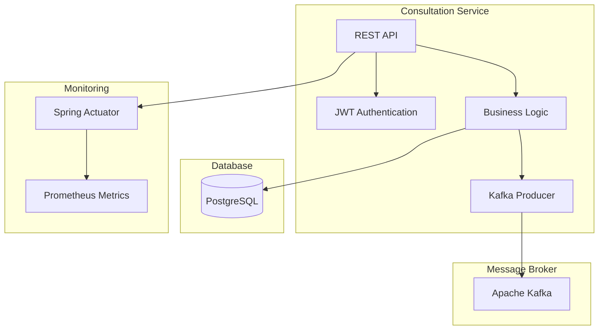

# 🏥 FIAP Consultation Service

> **Serviço responsável por criar agendamentos médicos**  
> *Documentação gerada com Amazon Q CLI*

[](https://github.com/itmoura/fiap-consultation-service/actions/workflows/ci.yml)
[](https://openjdk.java.net/projects/jdk/21/)
[](https://spring.io/projects/spring-boot)
[](https://www.postgresql.org/)
[](https://kafka.apache.org/)

## 📋 Índice

- [Sobre o Projeto](#-sobre-o-projeto)
- [Arquitetura](#-arquitetura)
- [Tecnologias Utilizadas](#-tecnologias-utilizadas)
- [Pré-requisitos](#-pré-requisitos)
- [Instalação e Execução](#-instalação-e-execução)
- [API Endpoints](#-api-endpoints)
- [Estrutura do Projeto](#-estrutura-do-projeto)
- [Testes](#-testes)
- [Configuração](#-configuração)
- [Docker](#-docker)
- [CI/CD](#-cicd)
- [Contribuição](#-contribuição)

## 🎯 Sobre o Projeto

O **FIAP Consultation Service** é uma aplicação Spring Boot desenvolvida para gerenciar agendamentos médicos. O sistema permite:

- ✅ **Gestão de Usuários**: Cadastro e gerenciamento de médicos, pacientes, enfermeiros e administradores
- ✅ **Agendamento de Consultas**: Criação, atualização, confirmação e cancelamento de consultas
- ✅ **Autenticação JWT**: Sistema de segurança baseado em tokens
- ✅ **Integração com Kafka**: Mensageria para eventos de agendamento
- ✅ **API RESTful**: Endpoints bem documentados com OpenAPI/Swagger
- ✅ **Monitoramento**: Health checks e métricas com Actuator

## 🏗️ Arquitetura



### Padrões Arquiteturais

- **Clean Architecture**: Separação clara entre camadas de domínio, aplicação e infraestrutura
- **Domain-Driven Design (DDD)**: Modelagem baseada no domínio do negócio
- **Repository Pattern**: Abstração da camada de dados
- **DTO Pattern**: Transferência de dados entre camadas
- **Factory Pattern**: Criação de entidades de domínio

## 🛠️ Tecnologias Utilizadas

### Core Framework
- **Java 21** - Linguagem de programação
- **Spring Boot 3.5.6** - Framework principal
- **Spring Security** - Autenticação e autorização
- **Spring Data JPA** - Persistência de dados
- **Spring Validation** - Validação de dados

### Database & Messaging
- **PostgreSQL** - Banco de dados principal
- **H2 Database** - Banco em memória para testes
- **Apache Kafka 3.9.0** - Message broker
- **HikariCP** - Pool de conexões

### Security & Documentation
- **JWT (java-jwt 4.2.1)** - Tokens de autenticação
- **OpenAPI 3 (SpringDoc 2.8.8)** - Documentação da API
- **Swagger UI** - Interface para testes da API

### Testing & Quality
- **JUnit 5** - Framework de testes
- **Mockito** - Mocking para testes unitários
- **Cucumber** - Testes BDD
- **Spring Boot Test** - Testes de integração

### Build & DevOps
- **Gradle 8.14.3** - Build tool
- **Docker & Docker Compose** - Containerização
- **GitHub Actions** - CI/CD pipeline
- **Lombok** - Redução de boilerplate

## 📋 Pré-requisitos

- **Java 21** ou superior
- **Docker** e **Docker Compose**
- **Git**
- **Gradle** (opcional, wrapper incluído)

## 🚀 Instalação e Execução

### 1. Clone o Repositório

```bash
git clone https://github.com/itmoura/fiap-consultation-service.git
cd fiap-consultation-service
```

### 2. Inicie os Serviços de Infraestrutura

```bash
# Inicia PostgreSQL, Kafka e Kafka UI
docker-compose up -d
```

### 3. Execute a Aplicação

#### Opção A: Via Gradle
```bash
# Linux/Mac
./gradlew bootRun

# Windows
gradlew.bat bootRun
```

#### Opção B: Via IDE
- Importe o projeto na sua IDE favorita
- Execute a classe `ConsultationServiceApplication`

#### Opção C: Via JAR
```bash
./gradlew build
java -jar build/libs/consultation-service-0.0.1-SNAPSHOT.jar
```

### 4. Acesse a Aplicação

- **API**: http://localhost:8080
- **Swagger UI**: http://localhost:8080/swagger-ui.html
- **Health Check**: http://localhost:8080/actuator/health
- **Kafka UI**: http://localhost:8085

## 📡 API Endpoints

### 👥 Usuários (`/api/users`)

| Método | Endpoint | Descrição | Autenticação |
|--------|----------|-----------|--------------|
| `GET` | `/api/users` | Lista todos os usuários | ✅ |
| `GET` | `/api/users/paginated` | Lista usuários paginados | ✅ |
| `GET` | `/api/users/{id}` | Busca usuário por ID | ✅ |
| `GET` | `/api/users/email/{email}` | Busca usuário por email | ✅ |
| `GET` | `/api/users/type/{type}` | Busca usuários por tipo | ✅ |
| `POST` | `/api/users` | Cria novo usuário | ❌ |
| `PUT` | `/api/users/{id}` | Atualiza usuário | ✅ |
| `DELETE` | `/api/users/{id}` | Desativa usuário | ✅ |
| `PATCH` | `/api/users/{id}/activate` | Ativa usuário | ✅ |
| `PATCH` | `/api/users/{id}/change-password` | Altera senha | ✅ |
| `GET` | `/api/users/count` | Conta usuários ativos | ✅ |
| `GET` | `/api/users/count/type/{type}` | Conta usuários por tipo | ✅ |

### 🏥 Consultas (`/api/consultations`)

| Método | Endpoint | Descrição | Permissões |
|--------|----------|-----------|------------|
| `GET` | `/api/consultations` | Lista todas as consultas | MEDIC, NURSE |
| `GET` | `/api/consultations/today` | Lista consultas por data | MEDIC, NURSE |
| `POST` | `/api/consultations` | Cria nova consulta | MEDIC, NURSE |
| `PUT` | `/api/consultations/{id}` | Atualiza consulta | MEDIC, NURSE |
| `PATCH` | `/api/consultations/{id}/confirm` | Confirma consulta | PATIENT |
| `PATCH` | `/api/consultations/{id}/cancel` | Cancela consulta | PATIENT |

### 📊 Monitoramento (`/actuator`)

| Endpoint | Descrição |
|----------|-----------|
| `/actuator/health` | Status da aplicação |
| `/actuator/metrics` | Métricas da aplicação |
| `/actuator/prometheus` | Métricas para Prometheus |
| `/actuator/info` | Informações da aplicação |

## 📁 Estrutura do Projeto

```
src/
├── main/
│   ├── java/com/fiap/itmoura/consultation_service/
│   │   ├── ConsultationServiceApplication.java
│   │   ├── shared/                          # Componentes compartilhados
│   │   │   ├── config/                      # Configurações
│   │   │   │   ├── CorsConfig.java
│   │   │   │   ├── DataLoader.java
│   │   │   │   └── security/                # Configurações de segurança
│   │   │   │       ├── JWTConfig.java
│   │   │   │       ├── JWTAuthFilter.java
│   │   │   │       └── JWTValidFilter.java
│   │   │   ├── domain/                      # Domínios compartilhados
│   │   │   │   ├── UserDetailData.java
│   │   │   │   └── ValidationErrorDTO.java
│   │   │   ├── exception/                   # Exceções customizadas
│   │   │   │   ├── BadRequestException.java
│   │   │   │   ├── ConflictRequestException.java
│   │   │   │   └── ForbiddenException.java
│   │   │   └── application/
│   │   │       ├── impl/
│   │   │       │   └── UserDetailServiceImpl.java
│   │   │       └── handlers/
│   │   │           └── ControllerExceptionHandler.java
│   │   ├── user/                            # Módulo de usuários
│   │   │   ├── domain/
│   │   │   │   └── Users.java               # Entidade usuário
│   │   │   ├── application/
│   │   │   │   ├── UserController.java      # Controller REST
│   │   │   │   ├── domain/
│   │   │   │   │   ├── UserDTO.java         # DTO de usuário
│   │   │   │   │   ├── OnCreate.java        # Grupo de validação
│   │   │   │   │   ├── OnUpdate.java        # Grupo de validação
│   │   │   │   │   └── enums/
│   │   │   │   │       └── TypeUserEnum.java
│   │   │   │   ├── interfaces/
│   │   │   │   │   └── UserControllerInterface.java
│   │   │   │   └── service/
│   │   │   │       └── UserService.java     # Serviço de usuários
│   │   │   └── infrastructure/
│   │   │       └── persistence/
│   │   │           └── UserRepository.java  # Repositório JPA
│   │   └── consultation/                    # Módulo de consultas
│   │       ├── domain/
│   │       │   ├── Consultation.java        # Entidade consulta
│   │       │   └── enums/
│   │       │       └── ConsultationStatusEnum.java
│   │       ├── application/
│   │       │   ├── ConsultationController.java
│   │       │   ├── dto/
│   │       │   │   ├── request/
│   │       │   │   │   ├── ConsultationRequest.java
│   │       │   │   │   ├── ConsultationSearchRequest.java
│   │       │   │   │   └── ConsultationKafkaRequest.java
│   │       │   │   └── response/
│   │       │   │       └── ConsultationResponse.java
│   │       │   ├── interfaces/
│   │       │   │   └── ConsultationInterface.java
│   │       │   └── usecases/
│   │       │       ├── ConsultationService.java
│   │       │       ├── impl/
│   │       │       │   └── ConsultationServiceImpl.java
│   │       │       └── aspect/
│   │       ├── infrastructure/
│   │       │   ├── persistence/
│   │       │   │   └── ConsultationRepository.java
│   │       │   └── producer/
│   │       │       └── ConsultationKafkaProducer.java
│   │       └── config/
│   │           └── kafkaSchedulingConfig.java
│   └── resources/
│       └── application.yml                  # Configurações da aplicação
└── test/                                    # Testes unitários
    └── java/com/fiap/itmoura/consultation_service/
        ├── consultation/
        │   ├── application/
        │   │   ├── ConsultationControllerTest.java
        │   │   └── usecases/impl/
        │   │       └── ConsultationServiceImplTest.java
        │   └── domain/
        │       ├── ConsultationTest.java
        │       └── enums/
        │           └── ConsultationStatusEnumTest.java
        ├── user/
        │   ├── application/
        │   │   ├── UserControllerTest.java
        │   │   ├── domain/enums/
        │   │   │   └── TypeUserEnumTest.java
        │   │   └── service/
        │   │       └── UserServiceTest.java
        │   └── domain/
        │       └── UsersTest.java
        └── shared/
            └── exception/
                └── ExceptionsTest.java
```

## 🧪 Testes

O projeto possui **60 testes unitários** distribuídos em **10 classes de teste**.

### Executar Testes

```bash
# Executar todos os testes
./gradlew test

# Executar testes com relatório detalhado
./gradlew test --info

# Executar testes de uma classe específica
./gradlew test --tests "UserServiceTest"
```

### Cobertura de Testes

- ✅ **Entidades de Domínio**: Users, Consultation
- ✅ **Serviços**: UserService, ConsultationServiceImpl
- ✅ **Controllers**: UserController, ConsultationController
- ✅ **Enums**: TypeUserEnum, ConsultationStatusEnum
- ✅ **Exceções**: BadRequestException, ConflictRequestException, ForbiddenException

### Relatórios

Os relatórios de teste são gerados em:
- **HTML**: `build/reports/tests/test/index.html`
- **XML**: `build/test-results/test/`

## ⚙️ Configuração

### Profiles Disponíveis

#### Development (`develop`)
```yaml
spring:
  profiles:
    active: develop
  datasource:
    url: jdbc:postgresql://localhost:5432/consultation-db
    username: postgres
    password: root
```

#### Test (`test`)
```yaml
spring:
  profiles:
    active: test
  datasource:
    url: jdbc:h2:mem:testdb
    driver-class-name: org.h2.Driver
```

### Variáveis de Ambiente

| Variável | Descrição | Padrão |
|----------|-----------|--------|
| `SPRING_PROFILES_ACTIVE` | Profile ativo | `develop` |
| `APP_PORT` | Porta da aplicação | `8080` |
| `DB_HOST` | Host do PostgreSQL | `localhost` |
| `DB_PORT` | Porta do PostgreSQL | `5432` |
| `DB_SCHEMA` | Nome do banco | `consultation-db` |
| `BD_USER` | Usuário do banco | `postgres` |
| `BD_PASS` | Senha do banco | `root` |

### JWT Configuration

```yaml
security:
  jwt:
    secret: 'ffb6a59f-459a-4619-8932-dd6db1b64b1c'
    expiration-time: 86400000  # 24 horas
```

## 🐳 Docker

### Serviços Disponíveis

```yaml
# docker-compose.yaml
services:
  postgres:          # PostgreSQL Database
    ports: ["5432:5432"]
    
  apache-kafka:      # Apache Kafka
    ports: ["9092:9092"]
    
  kafka-ui:          # Kafka Management UI
    ports: ["8085:8085"]
```

### Comandos Docker

```bash
# Iniciar todos os serviços
docker-compose up -d

# Parar todos os serviços
docker-compose down

# Ver logs dos serviços
docker-compose logs -f

# Reiniciar um serviço específico
docker-compose restart postgres
```

## 🔄 CI/CD

### GitHub Actions Workflow

O projeto possui um pipeline de CI/CD configurado em `.github/workflows/ci.yml`:

```yaml
name: CI
on:
  push:
    branches: [ main ]
  pull_request:
    branches: [ main ]

jobs:
  test:
    runs-on: ubuntu-latest
    steps:
    - uses: actions/checkout@v4
    - name: Set up JDK 21
      uses: actions/setup-java@v4
    - name: Run tests
      run: ./gradlew test
    - name: Build application
      run: ./gradlew build
```

### Pipeline Stages

1. **Checkout**: Download do código
2. **Setup Java 21**: Configuração do ambiente
3. **Cache Gradle**: Otimização de build
4. **Run Tests**: Execução dos testes
5. **Build**: Compilação da aplicação

## 📊 Modelos de Dados

### User (Usuário)

```json
{
  "id": "uuid",
  "name": "string",
  "email": "string",
  "password": "string (write-only)",
  "typeUserRole": "MEDIC|PATIENT|NURSE|ADMIN",
  "createdAt": "datetime",
  "lastUpdate": "datetime"
}
```

### Consultation (Consulta)

```json
{
  "id": "uuid",
  "medic": "UserDTO",
  "patient": "UserDTO",
  "startDate": "datetime",
  "finalDate": "datetime",
  "status": "SCHEDULED|CONFIRMED|CANCELLED|COMPLETED",
  "description": "string"
}
```

### ConsultationRequest

```json
{
  "medicId": "uuid",
  "patientId": "uuid",
  "startDate": "dd/MM/yyyy HH:mm",
  "timeDuration": "HH:mm",
  "description": "string"
}
```

## 🔐 Autenticação e Autorização

### Tipos de Usuário

- **ADMIN**: Acesso total ao sistema
- **MEDIC**: Pode gerenciar consultas e visualizar pacientes
- **NURSE**: Pode gerenciar consultas
- **PATIENT**: Pode confirmar/cancelar suas consultas

### Fluxo de Autenticação

1. **Login**: `POST /api/auth/login` (endpoint não implementado no código analisado)
2. **Token JWT**: Retornado no header `Authorization: Bearer <token>`
3. **Validação**: Middleware valida token em cada requisição
4. **Autorização**: Verificação de permissões por endpoint

## 🚨 Tratamento de Erros

### Exceções Customizadas

- **BadRequestException** (400): Dados inválidos ou não encontrados
- **ConflictRequestException** (409): Conflito de dados (email duplicado, horário ocupado)
- **ForbiddenException** (403): Acesso negado

### Formato de Resposta de Erro

```json
{
  "timestamp": "2024-10-07T14:30:00",
  "status": 400,
  "error": "Bad Request",
  "message": "Usuário não encontrado",
  "path": "/api/users/123"
}
```

## 📈 Monitoramento e Observabilidade

### Health Checks

```bash
# Status geral da aplicação
GET /actuator/health

# Status detalhado
GET /actuator/health?show-details=always
```

### Métricas

```bash
# Métricas gerais
GET /actuator/metrics

# Métricas específicas
GET /actuator/metrics/jvm.memory.used

# Formato Prometheus
GET /actuator/prometheus
```

## 🤝 Contribuição

### Como Contribuir

1. **Fork** o projeto
2. **Clone** seu fork: `git clone <seu-fork>`
3. **Crie uma branch**: `git checkout -b feature/nova-funcionalidade`
4. **Faça suas alterações** e **adicione testes**
5. **Execute os testes**: `./gradlew test`
6. **Commit**: `git commit -m "feat: adiciona nova funcionalidade"`
7. **Push**: `git push origin feature/nova-funcionalidade`
8. **Abra um Pull Request**

### Padrões de Commit

Seguimos o padrão [Conventional Commits](https://www.conventionalcommits.org/):

- `feat:` Nova funcionalidade
- `fix:` Correção de bug
- `docs:` Documentação
- `test:` Testes
- `refactor:` Refatoração
- `ci:` CI/CD

### Code Style

- **Java**: Seguir convenções do Google Java Style Guide
- **Testes**: Nomenclatura descritiva (`should...When...`)
- **Commits**: Mensagens em inglês, descritivas

## 📄 Licença

Este projeto está sob a licença MIT. Veja o arquivo [LICENSE](LICENSE) para mais detalhes.

---

**Desenvolvido com ❤️ para FIAP**  
*Documentação gerada automaticamente com Amazon Q CLI*
